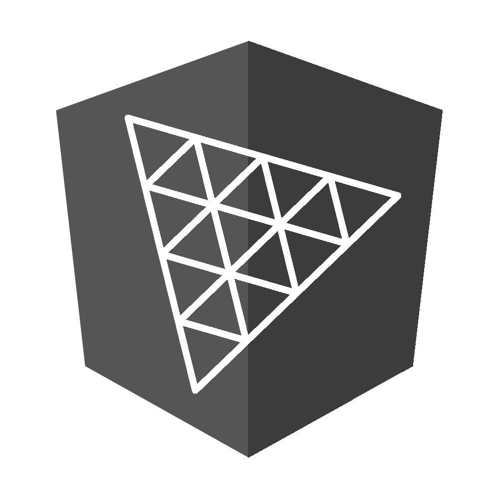
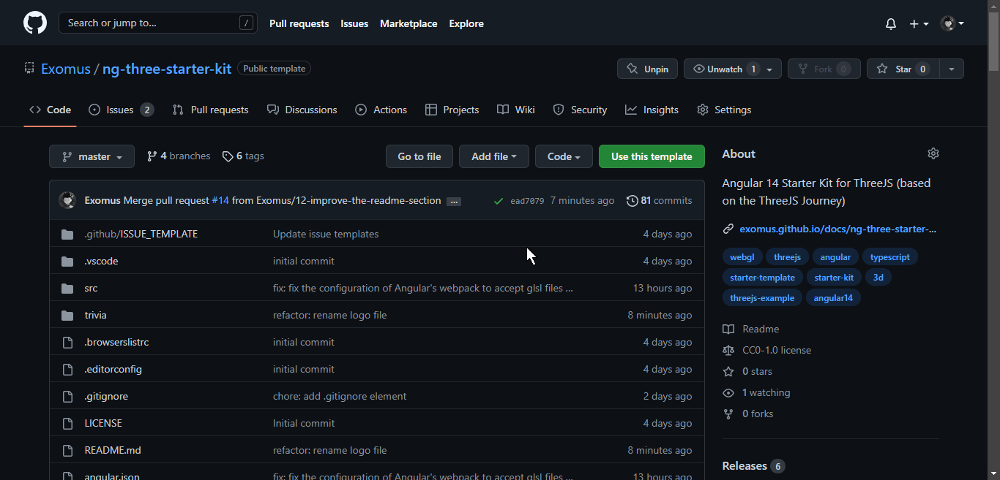

<div align="center">
	<br>
    
	<h1>ng-three-starter-kit</h1>
	<p>
		<b>An Angular 14 template for your ThreeJS experiences</b>
	</p>
    <p align="center">
        <a src="https://sonarcloud.io/summary/new_code?id=Exomus_ng-three-starter-kit" >
            
        </a>
        <a src="https://sonarcloud.io/summary/new_code?id=Exomus_ng-three-starter-kit" >
            
        </a>
        <a src="https://sonarcloud.io/summary/new_code?id=Exomus_ng-three-starter-kit" >
            
        </a>
        <a src="https://sonarcloud.io/summary/new_code?id=Exomus_ng-three-starter-kit" >
            
        </a>
        <a src="https://sonarcloud.io/summary/new_code?id=Exomus_ng-three-starter-kit" >
            
        </a> 
        <a src="https://sonarcloud.io/summary/new_code?id=Exomus_ng-three-starter-kit" >
            
        </a>
        <a src="https://sonarcloud.io/summary/new_code?id=Exomus_ng-three-starter-kit" >
            
        </a>
        <a src="https://sonarcloud.io/summary/new_code?id=Exomus_ng-three-starter-kit" >
            
        </a>
        <a src="https://sonarcloud.io/summary/new_code?id=Exomus_ng-three-starter-kit" >
            
        </a>
        <a src="https://0xaxiome.github.io/docs/ng-three-starter-kit/v0.4.0/">
            
        </a>
    </p>
</div>
<br>
    
</p>

# Stack 🧰

<p>
    
    
    
    
</p>

- Angular v14
- Threejs (r142)
- @types/three (r141)

# Quick Start 🏁

➡️[ Documentation ](https://0xaxiome.github.io/)⬅️

## How to use this template 🔧

<p align="center">
    
</p>

- Click on [***Use this template***](https://github.com/Exomus/ng-three-starter-kit/generate)
- Enter the ✨*awesome*✨ name of your repository
- Choose the visibility of the repo
- Click on ***Create repository from template***
- You are now the owner of a new Angular ThreeJS project. Congratulations !

(You can clone your new repository with `git clone <name-of-your-repository>` in your Terminal)

## Serve the application 👨‍💻

```shell
npm start
```

<p align="center">or</p>

```shell
ng serve
```

By default, you can access it through: http://localhost:4200/

### What you should see

<p align="center">
    
</p>

## Build the application 🏗️

```shell
npm run build
```

<p align="center">or</p>

```shell
ng build
```

A `dist` folder is generated that can be statically hosted.

## Debug and tweak your 3D scene with lil-gui 🐞

By default, you can add `#debug` in the URL to access the debug panel, useful to tweak your scene.

Be sure to give **a reload** if you cannot see it.

### What you can expect to see

<p align="center">
    
</p>

# Special Thanks 💖

Huge thanks to [Bruno Simon](https://twitter.com/bruno_simon) for all the inspiration and the lessons
he provides kindly.

This project is highly inspired by the [Threejs Journey](https://threejs-journey.com/) (Highly recommend it by the way).

I reworked the whole thing, so that it would fit in an Angular 14 project, with Typescript, obviously.

# Features 🛠️

- Boilerplate code to set up the Threejs Scene, ready to use.
- 3D Assets to test that the template is working for you with the loaders.
    - GLTF Loader: You should see the
      famous [GLTF Fox](https://github.com/KhronosGroup/glTF-Sample-Models/tree/master/2.0/Fox) on startup (animated)
    - Texture Loader: You should see the floor with both color and normal textures.
    - Cube Texture Loader: You should also see that the environment map is loaded and applied on the scene.
- Architecture of the project in many folders to keep it organized
- Debug UI integrated (equivalent to dat-gui) and easily accessible due to static singleton pattern
- Util service
    - Executes the animation loop and the resize outside the NgZone to avoid performance issues due to Angular's Change
      detection
    - Information obtainable easily without painful constructor argument everywhere. (static method)
    - Provides a PointerService to handle pointermove events and executes the pointermove callback of the engine outside
      the NgZone

# Incoming Features ⚙️

- Jest integration for unit testing (over Karma/Jasmine)
- Draco Compression option handling for the GLTF loader

# Notes 🗒️

You don't need to use the "THREE" namespace in the project as usual.
You can simply put the name of the type you want to use and put the right import.

```typescript
import * as THREE from 'three';

const geometry = new THREE.BoxBufferGeometry(1, 1, 1);
const material = new THREE.MeshBasicMaterial({ color: 0xff0000 });

const mesh = new THREE.Mesh(geometry, material);
//...
```

becomes

```typescript
import { BoxBufferGeometry, MeshBasicMaterial, Mesh } from 'three';

const geometry = new BoxBufferGeometry(1, 1, 1);
const material = new MeshBasicMaterial({ color: 0xff0000 });

const mesh = new Mesh(geometry, material);
//...
```

It's, in my opinion, a more angular-friendly way of writing our code.

# Twitter 🐦

You can reach me on Twitter:

[](https://twitter.com/axiom_3d)
